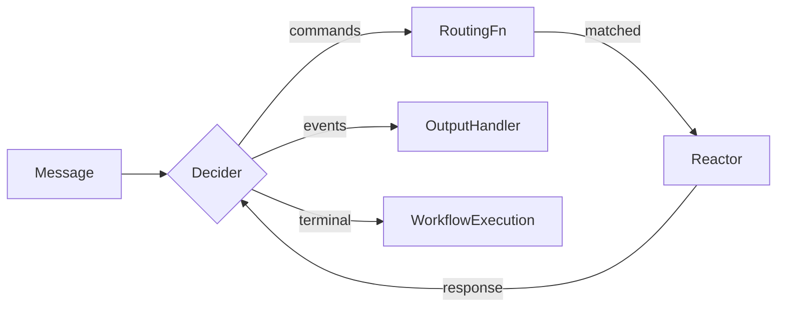
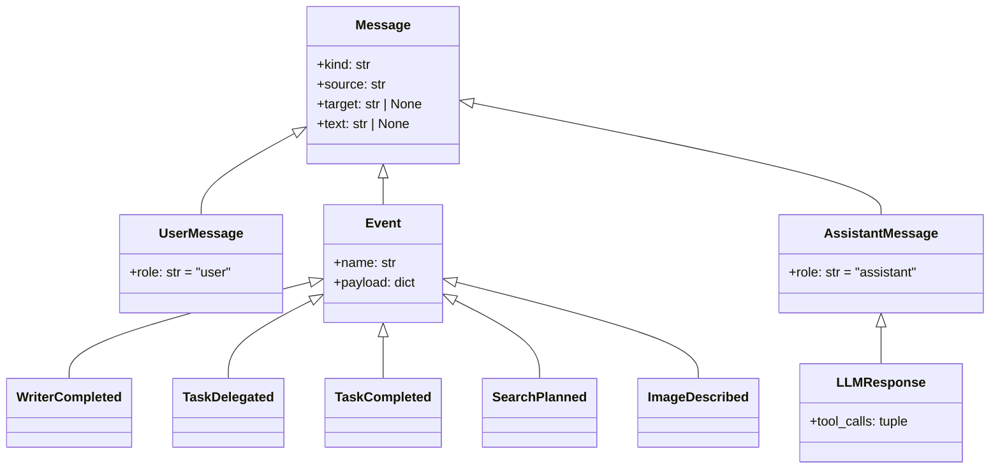

## Overview

Every lab builds on the same set of abstractions. This page explains them once so the lab pages
can focus on what changes at each step.



## Message

The base type for everything that flows through a workflow. All messages are frozen dataclasses.

```python title="agentic/workflow/messages.py"
@dataclass(frozen=True, slots=True, kw_only=True)
class Message:
    kind: str = "message"
    source: str = ""
    target: str | None = None
    text: str | None = None
    runtime_id: str = ""
    turn_id: str = ""
```

Key subtypes:

- `UserMessage` -- carries user input (`role = "user"`)
- `Event` -- domain events like `WriterCompleted`, `TaskDelegated`, `SearchPlanned`
- `AssistantMessage` -- agent output
- `LLMResponse` -- extends `AssistantMessage` with `tool_calls`



## Decider

A pure function that decides **what** should happen in response to a message. It returns commands
(routed to a Reactor) or domain events (routed to output handlers).

```python
Decider = Callable[[Message], Sequence[Message]]
```

Deciders never perform side effects. They pattern-match on message type:

```python title="example decider"
def writer_decider(msg: Message) -> Sequence[Message]:
    if isinstance(msg, UserMessage):
        return [msg]  # route to LLM reactor
    if isinstance(msg, LLMResponse):
        return [WriterCompleted(source="writer", writer_output=msg.text or "")]
    return []
```

Introduced in [Lab 1](/docs/workshops/lab1).

## Reactor

A protocol that performs side effects for a single command type. The most common reactor wraps an
LLM agent.

```python title="agentic/workflow/reactor.py"
class Reactor(Protocol):
    def can_handle(self, command: Message) -> bool: ...
    def invoke(self, command: Message) -> Message: ...
```

Built-in implementations:

- `LLMReactor` -- wraps a `CoreAgentic` for single-turn LLM calls
- `MultiTurnLLMReactor` -- handles tool-calling loops
- `VLMReactor` -- multimodal agent with image support ([Lab 5](/docs/workshops/lab5))

## TechnicalRoutingFn

Maps commands to the Reactor that handles them. The routing function decides **how** a command
executes.

```python
TechnicalRoutingFn = Callable[[Message], Reactor | None]
```

The helper `make_llm_routing(reactor)` creates a routing function that sends all `UserMessage`
instances to the given reactor.

## WorkflowOutputHandler

Reacts to emitted events. Declared with a tuple of event types it matches and a strategy
(per-message or batched).

```python title="agentic/workflow/output_handler.py"
handler = workflow_output_handler(
    can_handle=(WriterCompleted,),
    each_message=_handle_writer_completed,
    name="critic",
)
```

Used with `dispatch_output_handlers()` in Labs 1-3, and registered on the runtime message bus
in Lab 4+.

## WorkflowExecution

The structured result of running one workflow turn. Contains the final text, any emitted events,
and recorded turn data.

```python title="agentic/workflow/execution.py"
@dataclass(frozen=True, slots=True)
class WorkflowExecution:
    text: str
    agent_result: AgentResult | None = None
    tool_results: tuple[ToolRunResult, ...] = ()
    emitted_events: tuple[Message, ...] = ()
    recorded_turns: tuple[ExecutionTurnRecord, ...] = ()
```

The `emitted_events` tuple is what drives the output handler dispatch chain.

## WorkflowRuntime

The central orchestration layer introduced in [Lab 4](/docs/workshops/lab4). Combines:

- A **workflow registry** -- named workflows registered at startup
- A **message bus** -- publishes turn messages and emitted events
- **Output handlers** -- attached to the bus, fire automatically on matching events
- **Lifecycle events** -- `TurnStarted` and `TurnCompleted` for observability

```python title="workshops/lab4/runtime.py"
runtime = WorkshopRuntime()
runtime.register_workflow("planner", make_planner_workflow(planner))
runtime.register_output_handler(handler)
result = runtime.run(message, "planner")
```

In [Lab 6](/docs/workshops/lab6), the same abstraction becomes `DistributedAgenticRuntime`
backed by Redis Streams.
