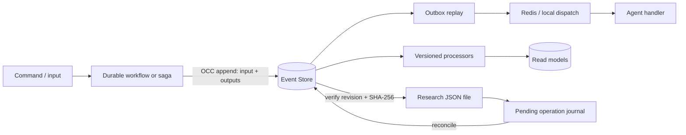

## Outcome

The agent system uses an append-only Event Store as the source of truth for process history. Mutable
read models, Redis Streams, and the SQLite message log are delivery or query mechanisms and can be
replayed. The resumable research example intentionally has a second source of truth: one atomic JSON
file owns the research artifact (queries, evidence, and summary), while the Event Store owns process
history. A pending-operation journal reconciles the two without a distributed transaction.

## Audit Status

| Area | Implemented control |
| --- | --- |
| Durable envelope | Message/event IDs, idempotency key, correlation, causation, tenant/workspace, contract and schema version, occurred/recorded timestamps, stream/global positions |
| Contract evolution | Stable wire contracts, aliases, chained raw-payload upcasters, legacy Python type compatibility |
| Event Store | OCC, atomic multi-message append, global ordered feed, stream-prefix reads, global event identity, per-stream idempotency, transactional SQLite projections |
| Local runtime | `DurableMessageBus`: append before dispatch, durable checkpoint, replay after append/dispatch crash; SQLite message log is an idempotent projection |
| Distributed runtime | Atomic workflow inbox/outbox, handler result replay, retry without ACK, pending reclaim, terminal DLQ before ACK, poison-message DLQ, publish failure without ACK |
| Redis durability | AOF `everysec`, bounded stream length, persistent volume, per-service persistent workflow Event Store |
| Read models | Global/stream processors with version, partition, batch size, lag stats, CAS checkpoint, and lease ownership; version bump starts a clean rebuild |
| Long-running work | Event-sourced saga coordinator with inbox/outbox, compensation action metadata, durable timers, deterministic timeout identity, and OCC |
| Tools | Explicit `SUCCESS`, `ERROR`, and `RETRY`; domain events are emitted only for successful tool results and all successful calls are considered |
| RAG | Durable, checkpointed knowledge-base projector; asynchronous runner exposes background failures and supports `flush` |
| LLM audit | Prompt snapshot plus model, provider, token usage, latency, finish reason, prompt hash, and generation-config hash |
| Sensitive payloads | Event Store payload-codec boundary for authenticated encryption/compression supplied by the deployment |
| Research recovery | Atomic file replacement, OS file lock, revision and content hash, pending operation journal, idempotent resume after crashes |

## Source-of-Truth Rules

1. A handler never ACKs an input before its durable workflow append and all required output publishes
   succeed.
2. Redis is a transport, not business history. Losing/rebuilding Redis must not lose a completed
   decision stored in the workflow stream.
3. `message_id` may identify one logical chunked message. `event_id` identifies a stored record, and
   `idempotency_key` identifies an operation. This prevents start/chunk/complete records from being
   incorrectly deduplicated.
4. Facts are past-tense events without a transport target. Intents are commands with a target. For
   example: `SearchPlanned` + `SearchRequested`, then `SearchResultsFetched` + `SummaryRequested`.
5. Side-effect handlers and projections must be idempotent because delivery is at least once.

## Recovery Procedures

### Interrupted research

Run the research agent with the same research ID. It first reconciles every pending file operation,
checks file revision and SHA-256 against the event stream, then continues with the first unfinished
query. Completed searches and summaries are not called again.

### Local process crash

Construct the runtime with the same Event Store and session. `DurableMessageBus.replay_pending()`
starts at its dispatch checkpoint. The query-oriented SQLite message log may contain a record that
was already projected before the crash; its `event_id` identity makes replay harmless.

### Distributed worker crash

Redis keeps the entry in the consumer group's pending list. A worker uses `XAUTOCLAIM`, loads or
creates its workflow stream, and either replays the durable outbox or executes the handler once. A
transient handler failure is not ACKed. A terminal or malformed record is published to the DLQ before
ACK.

### Projection rebuild

Deploy the new read model under a new processor version (and preferably a new physical table/index
name), replay the global feed from position zero, compare counts/checksums, then switch readers. Do
not reset the old checkpoint in place.

## Production Boundaries

The repository provides SQLite and in-memory implementations for local/workshop use. A production
deployment still needs environment-specific adapters and policy:

- the generic inline local `TurnExecutor` is not restart-resumable in the middle of an LLM call.
  Use a durable workflow/saga (as distributed services do) or the resumable research state machine
  for long-running work; the local durable bus guarantees message/output-handler delivery, not
  exactly-once execution of arbitrary handler side effects;
- implement the existing `EventStore`, checkpoint, and lease protocols on PostgreSQL or a dedicated
  event database; preserve unique event/idempotency constraints and one transaction for append plus
  inline projections;
- supply an authenticated-encryption payload codec backed by KMS/Vault, with key IDs and rotation;
- define retention per stream class. Immutable business streams usually use tombstones or
  crypto-shredding for PII rather than editing historical payloads;
- alert on processor lag, retry rate, pending age, DLQ growth, publish failures, lease loss, and
  Event Store latency;
- regularly run the opt-in resilience suite against real Redis and the production Event Store:
  kill a worker after append, during publish, before ACK, and during projection commit;
- back up Event Store and research files together, then test restore and hash reconciliation.

These are deliberately deployment boundaries rather than silent fallbacks: no in-process component
can provide PostgreSQL HA, KMS key management, or realistic network partitions by itself.
