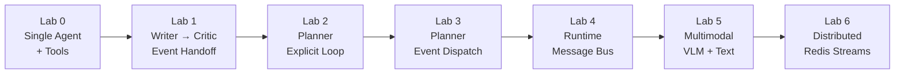
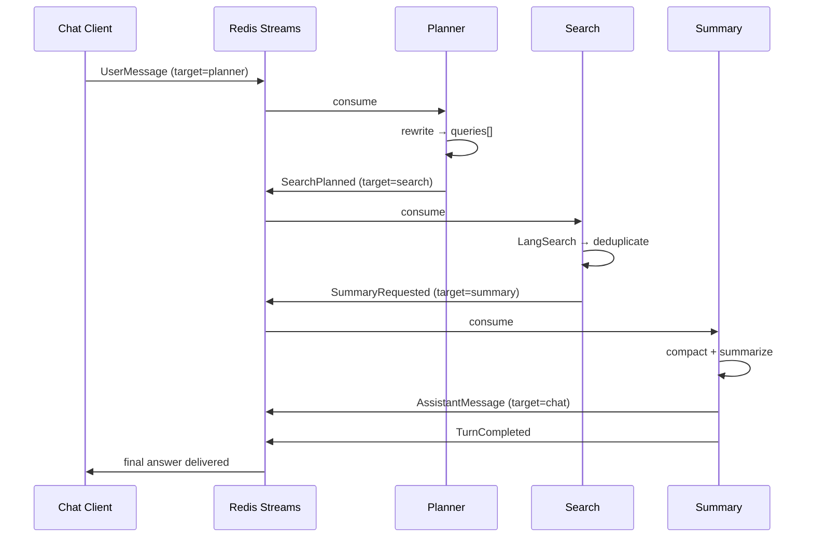

## Mental Model

The workshops are not separate products. They are a staged explanation of the same system ideas.

The sequence is:

1. Start with one agent that can call tools.
2. Add messages and events between agents.
3. Add planning and delegation.
4. Move orchestration into a runtime.
5. Add a multimodal branch.
6. Split the runtime across processes with Redis Streams.



## Lab Progression

### Lab 0: single turn, single agent, local tools

The user talks to one agent. The agent decides whether to answer directly or call a tool from a
registered toolset.

### Lab 1: event-driven handoff

The writer emits an event, and the critic reacts to it. This introduces the idea that agents do not
need to call each other directly.

### Lab 2: explicit planner loop

The planner creates tasks and the app runs workers in a visible loop. This is the most direct way
to understand delegation before the loop is abstracted away.

### Lab 3: output-handler dispatch

The same planner pattern becomes event-driven. The app stops iterating over tasks manually and lets
handlers route work.

### Lab 4: local runtime

A workshop runtime adds:

- workflow registration,
- a message bus,
- turn lifecycle events,
- a message log for observability.

### Lab 5: multimodal branch

The first step uses a VLM to describe an image. That emitted description becomes input for a text
agent that writes the final creative output.

### Lab 6: distributed runtime

The local flow becomes a distributed pipeline:

```text
chat -> planner -> search -> summary
```

Each service registers itself, publishes heartbeats, consumes only messages targeted to it, and
publishes the next message back to Redis Streams.

## Lab 6 Request Flow

1. The chat client publishes a `UserMessage` to the entry agent.
2. The planner rewrites the question into focused search queries.
3. The search agent calls LangSearch and deduplicates results by URL.
4. The summary agent compacts the results and generates the final answer.
5. The final answer is sent back to the original reply target and the turn is marked complete.



The relevant message types are:

- `SearchPlanned`
- `SummaryRequested`
- `AssistantMessage`
- `TurnCompleted`

## Why Workshops Are The Right Documentation Spine

The codebase has multiple packages, but `workshops` is where the architecture becomes visible
without needing to read the entire runtime implementation first. That is why these docs are
organized around labs first and reference second.
