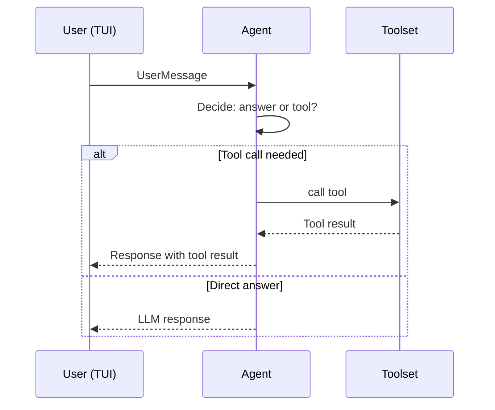

## What This Lab Teaches

How a single agent decides between answering directly and calling a tool.

## How It Works

- The app loads one local MLX model.
- The agent gets a small toolset: `get_current_time`, `calculate`, and `roll_dice`.
- The TUI can show the registered tool schemas with the `tools` command.



## Key Pattern

```python title="workshops/lab0/__init__.py"
toolset = Toolset([get_current_time, calculate, roll_dice])
agent = Agent(
    model_provider=model_provider,
    prompt_builder=QwenPromptBuilder(system_prompt=SYSTEM_PROMPT),
    toolsets=Toolsets([toolset]),
)

result: AgentResult = agent.run(message)
```

## Run It

```bash
uv run workshops lab0
```

## Done Looks Like

- You can type `tools` and inspect the schemas.
- A question like "What time is it?" results in a tool call rather than only a free-form answer.
- The activity sidebar shows reasoning, tool calls, and tool results.
