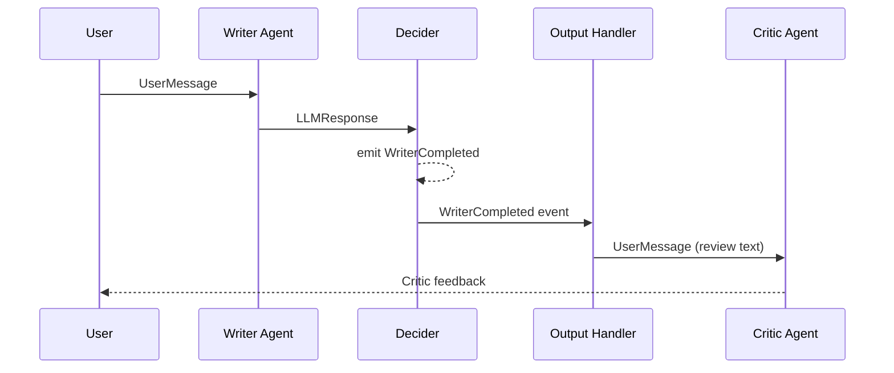

## What This Lab Teaches

How one agent can finish a step, emit an event, and trigger a second agent without hard-coding a
single combined prompt.

## How It Works

- The writer agent generates text from the user prompt.
- The workflow emits a `WriterCompleted` event.
- An output handler reacts to that event and invokes the critic.



## Key Pattern

The decider is a pure function that decides **what** happens next:

```python title="workshops/lab1/deciders.py"
def writer_decider(msg: Message) -> Sequence[Message]:
    if isinstance(msg, UserMessage):
        return [msg]  # route to LLM
    if isinstance(msg, LLMResponse):
        return [WriterCompleted(source="writer", writer_output=msg.text or "")]
    return []
```

The output handler reacts to the emitted event:

```python title="workshops/lab1/__init__.py"
critic_handler = workflow_output_handler(
    can_handle=(WriterCompleted,),
    each_message=_handle_writer_completed,
    name="critic",
)

critic_responses = dispatch_output_handlers(
    [critic_handler], writer_result.emitted_events
)
```

## Run It

```bash
uv run workshops lab1
```

## Done Looks Like

- The TUI shows the writer output first.
- The critic response appears as a second stage, not as one merged answer.
- The activity log shows the writer-to-critic handoff.
