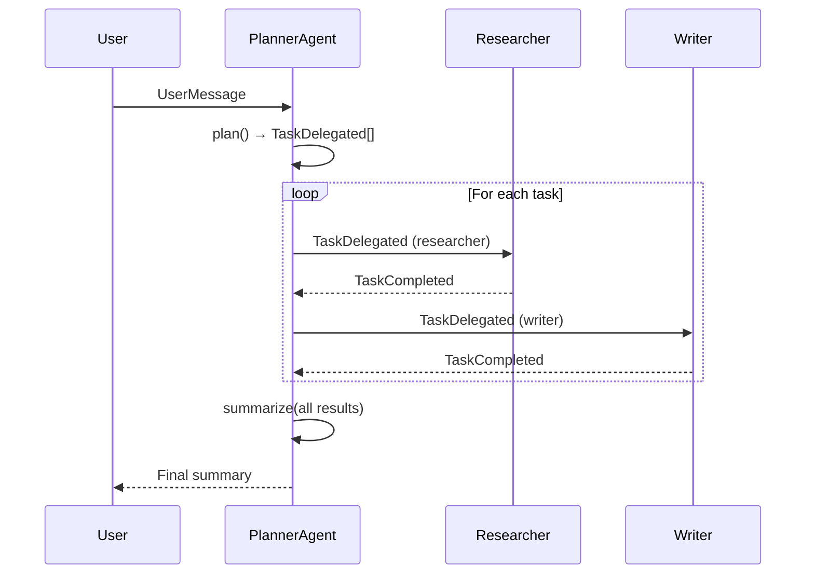

## What This Lab Teaches

How a planner breaks a user goal into tasks for worker agents and then merges the results back into
one answer.

## How It Works

- A `PlannerAgent` produces tasks for `researcher` and `writer`.
- The app iterates over those tasks explicitly.
- Each worker runs through the workflow layer.
- The planner summarizes all completed task outputs at the end.



## Key Pattern

The loop is explicit in the application code:

```python title="workshops/lab2/__init__.py"
tasks = planner.plan(message)

completed: list[TaskCompleted] = []
for task in tasks:
    worker_result = run_workflow(
        message=UserMessage(text=task.task_description, source="planner"),
        decider=worker_decider,
        routing_fn=worker_routings[task.target_agent],
    )
    completed.append(TaskCompleted(
        source=task.target_agent,
        target_agent=task.target_agent,
        task_description=task.task_description,
        result=worker_result.text,
    ))

summary = planner.summarize("\n\n".join(format_results(completed)))
```

## Run It

```bash
uv run workshops lab2
```

## Done Looks Like

- The plan is printed before the workers run.
- Each worker produces its own output block.
- A final planner summary appears after all delegated work completes.
