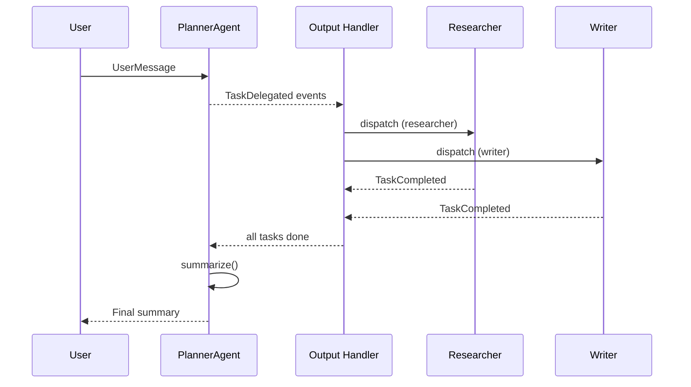

## What This Lab Teaches

How to keep the planner pattern from Lab 2 while moving orchestration into event dispatch.

## How It Works

- The planner still emits delegated tasks.
- Output handlers route those tasks to the correct worker.
- Worker completion is captured as `TaskCompleted` events.
- The planner summarizes after the event-driven worker stage is done.



## Key Pattern

The for-loop from Lab 2 becomes a declarative handler:

```python title="workshops/lab3/handlers.py"
def build_worker_dispatch_handler(
    worker_routings: dict[str, TechnicalRoutingFn],
    *,
    on_completed: Callable[[TaskCompleted], None] | None = None,
) -> tuple[WorkflowOutputHandler, list[TaskCompleted]]:

    handler = workflow_output_handler(
        can_handle=(TaskDelegated,),
        each_message=_handle_task_delegated,
        name="worker_dispatch",
    )
    return handler, completed_tasks
```

Events are dispatched automatically instead of iterated manually:

```python title="workshops/lab3/__init__.py"
handler, _ = build_worker_dispatch_handler(
    worker_routings, on_completed=on_task_completed,
)
responses = dispatch_output_handlers([handler], tasks)
```

## Run It

```bash
uv run workshops lab3
```

## Done Looks Like

- The plan is still visible.
- The workers are triggered by dispatch, not by a hand-written loop in the app logic.
- Completed tasks appear in the activity log as they return.
