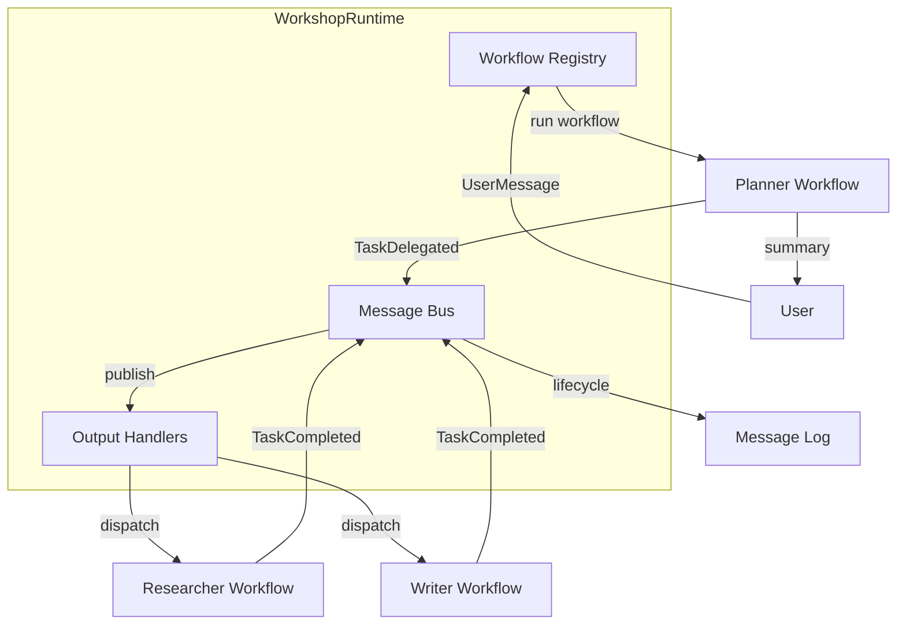

## What This Lab Teaches

How to move from ad hoc coordination into a reusable runtime abstraction.

## How It Works

- `WorkshopRuntime` registers named workflows.
- A message bus publishes turn messages and emitted events.
- Output handlers are attached to the bus.
- Turn lifecycle events such as `TurnStarted` and `TurnCompleted` become visible.
- The app can show the message log with the `log` command.



## Key Pattern

Workflows and handlers are registered once, then the runtime orchestrates:

```python title="workshops/lab4/__init__.py"
runtime = WorkshopRuntime()

runtime.register_workflow("planner", make_planner_workflow(planner))
runtime.register_workflow("researcher", make_worker_workflow("researcher", researcher))
runtime.register_workflow("writer", make_worker_workflow("writer", writer))

runtime.register_output_handler(
    build_worker_output_handler(
        worker_workflows, on_completed=on_task_completed,
    )
)

plan_text = runtime.run(message, "planner")
```

## Run It

```bash
uv run workshops lab4
```

## Done Looks Like

- The runtime handles the turn instead of the app stitching every stage together directly.
- The `log` command shows published bus messages.
- Planner, worker, and summary stages are still easy to follow from the UI.
