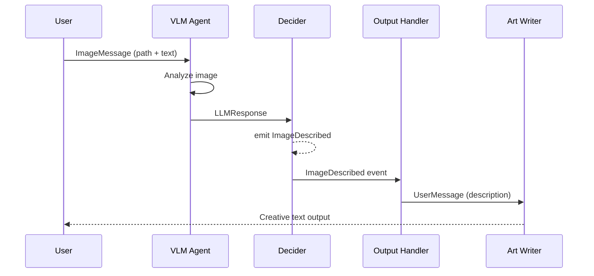

## What This Lab Teaches

How to pass image-derived context into a second agent as part of a normal event-driven flow.

## How It Works

- A VLM analyzes the image and produces a structured description.
- The workflow emits `ImageDescribed`.
- A second agent receives that description and writes the final creative output.
- The UI accepts either an attached file or the `<image_path> | <question>` input format.



## Key Pattern

A closure-based decider captures the image path:

```python title="workshops/lab5/deciders.py"
def make_image_decider(image_path: str = "") -> Decider:
    captured_path = image_path

    def image_decider(msg: Message) -> Sequence[Message]:
        nonlocal captured_path
        if isinstance(msg, ImageMessage):
            captured_path = msg.image_path
            return [msg]
        if isinstance(msg, LLMResponse):
            return [ImageDescribed(
                source="image_summary",
                image_path=captured_path,
                description=msg.text or "",
            )]
        return []

    return image_decider
```

## Run It

```bash
uv run workshops lab5
```

## Done Looks Like

- The app accepts an image path.
- The first stage explains the image content.
- The second stage produces a text response inspired by that description.
