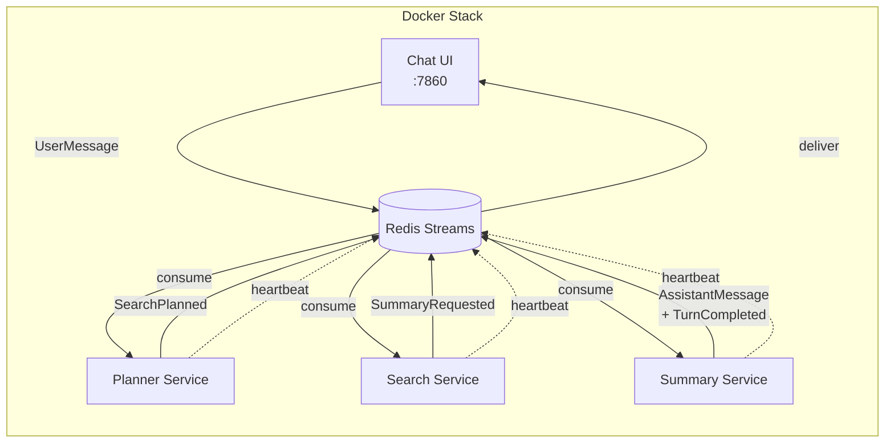

## What This Lab Teaches

How the workshop architecture changes once agents become separate services that discover each other,
consume targeted messages, and communicate through Redis Streams.

## How It Works

The topology is:



- The **planner** rewrites the question into `1` to `3` focused web queries.
- The **search** service calls LangSearch and deduplicates by URL.
- The **summary** service compacts the result set and writes the final answer in Polish with a
  `Źródła` section.
- Service discovery uses capabilities, heartbeats, and liveness TTL checks.

The concrete service names are:

- `planner`
- `search`
- `summary`

## Key Pattern

Each service is a handler that receives messages from Redis Streams and emits the next event:

```python title="workshops/lab6/messages.py"
@dataclass(frozen=True, slots=True, kw_only=True)
class SearchPlanned(Event):
    kind: str = "search_planned"
    name: str = "search_planned"
    target: str | None = "search"
    question: str = ""
    queries: tuple[str, ...] = ()
    reply_target: str = "chat"
```

The distributed runtime handles service discovery, heartbeats, and message targeting:

```python title="workshops/lab6/__init__.py"
runtime = DistributedAgenticRuntime.from_settings()
response = runtime.run(prompt)  # routes through planner → search → summary
```

## Run It

### Full Docker stack

```bash
cp .env.example .env
make lab6-up
```

### Optional local workshop client

```bash
uv run --package workshops workshops lab6
```

## Required Configuration

At minimum, set:

```dotenv
API_BASE_URL=http://localhost:1234
DOCKER_API_BASE_URL=http://host.docker.internal:1234
LANGSEARCH_API_KEY=...
AGENTIC_TRANSPORT=redis_streams
REDIS_URL=redis://redis:6379/0
CHAT_ENTRY_AGENT=planner
```

Use [Configuration](/docs/reference/configuration) for the full list.

## Useful Commands

- Type `agents` or `status` in the Lab 6 TUI to list live services.
- Open `http://localhost:7860` when the Docker chat service is running.

## Done Looks Like

- `planner`, `search`, and `summary` all register as live agents.
- A user question produces a final answer rather than stalling after planning or search.
- Missing services fail fast with capability-related runtime errors instead of hanging silently.

## Common Failure Modes

### No live search or summary agent

The discovery layer raises a runtime error when a required capability is missing.

### API endpoint reachable locally but not from Docker

Use `DOCKER_API_BASE_URL` so containers can reach the host model endpoint.

### Empty or weak results

Check `LANGSEARCH_API_KEY`, search/result limits, and the Lab 6 summary compaction settings.
