# Architecture Diagrams

## 1. General Architecture Overview

All packages with their internal components shown as nested boxes.

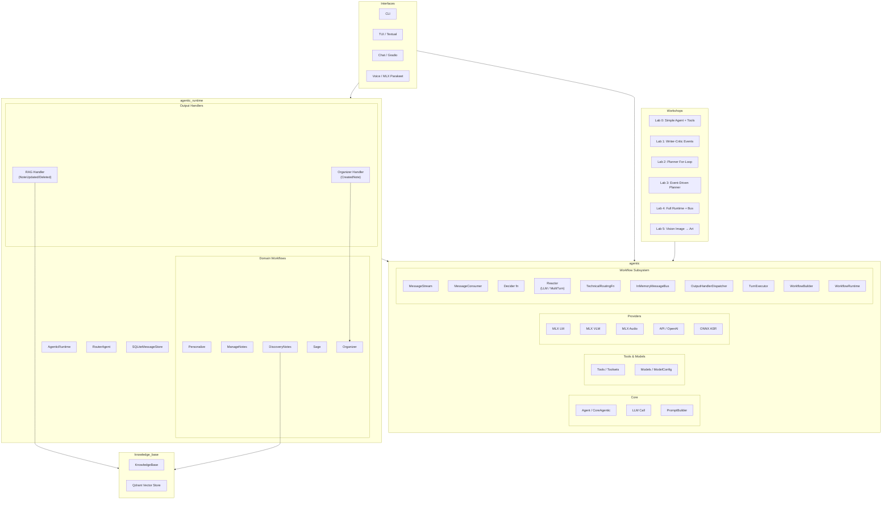

---

## 2. Chat & CLI Interface Flow

How user input flows from any interface through the runtime modes.

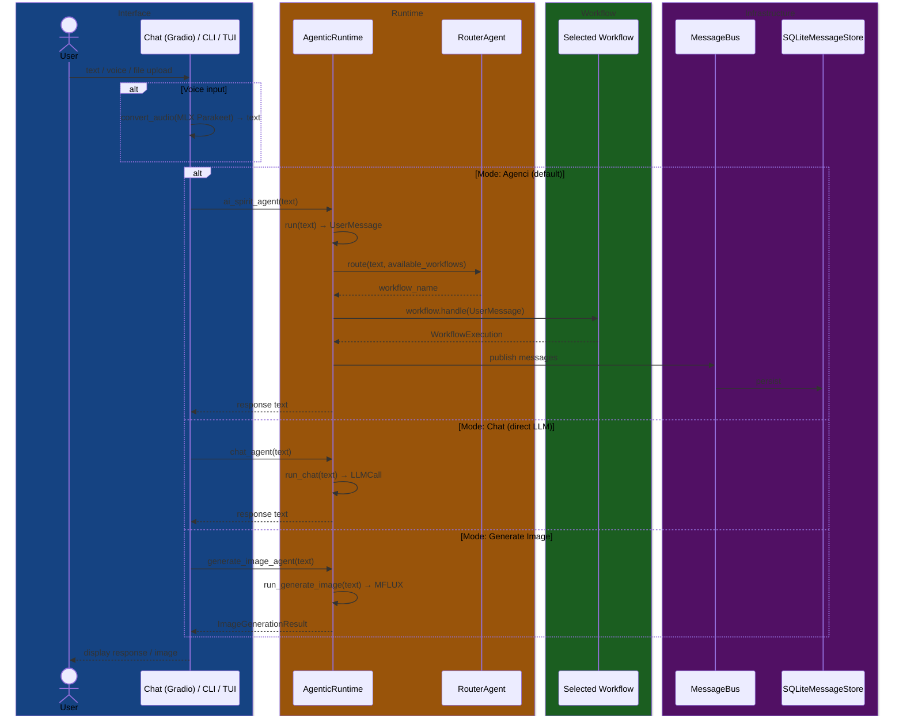

---

## 3. AgenticRuntime — Routing & Workflow Dispatch

Full lifecycle of a user message through the runtime: routing, turn execution, event dispatch.

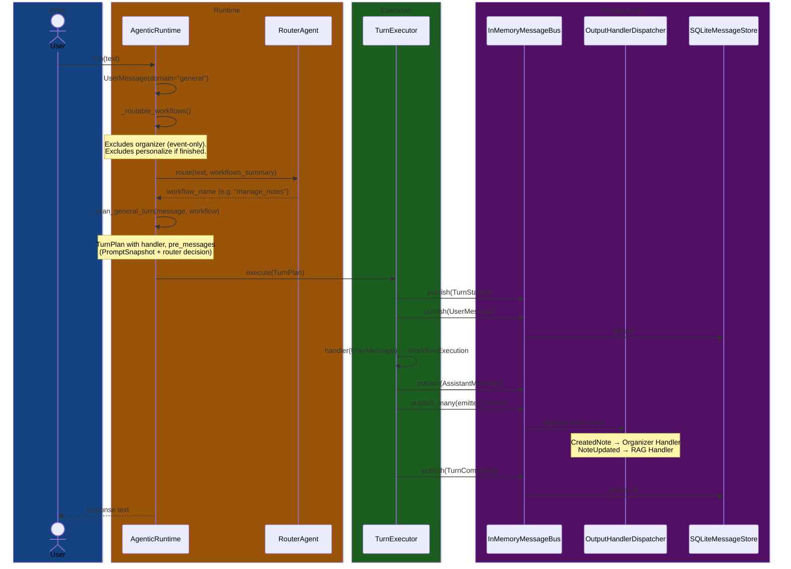

---

## 4. ManageNotes Workflow (Decider + Events)

Workflow with custom decider that parses tool calls into domain events (CreatedNote, NoteUpdated).

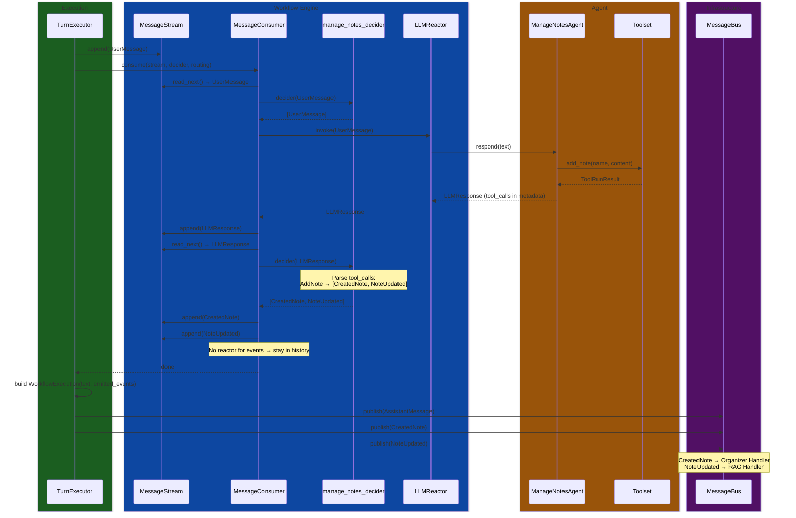

---

## 5. Sage Workflow (MultiTurn + Thinking)

Sage uses a thinking model. The MultiTurnLLMReactor strips `<think>` tags in post-processing.

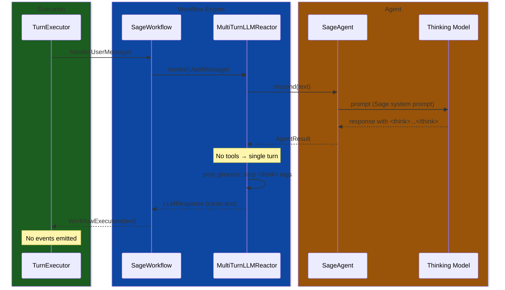

---

## 6. DiscoveryNotes Workflow (RAG Search)

Uses semantic search tool to query the Qdrant knowledge base.

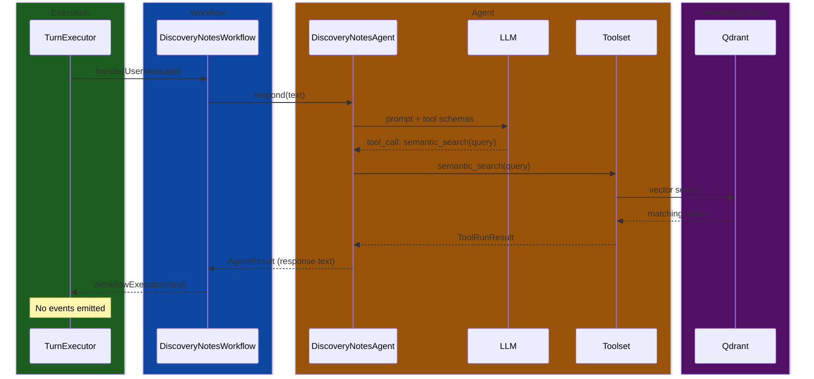

---

## 7. Personalize Workflow

Collects user preferences (name, vault). After completion, the workflow is excluded from routing.

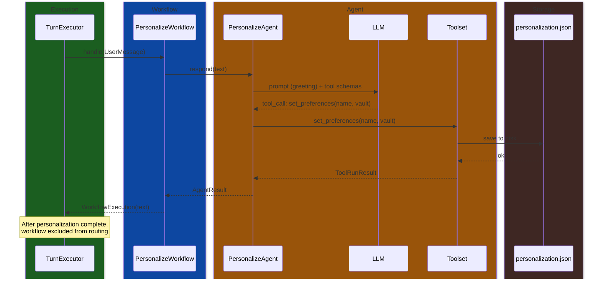

---

## 8. Organizer Workflow (Event-Driven, Not Routable)

Triggered only by CreatedNote events from the message bus. Classifies notes with PARA tags.

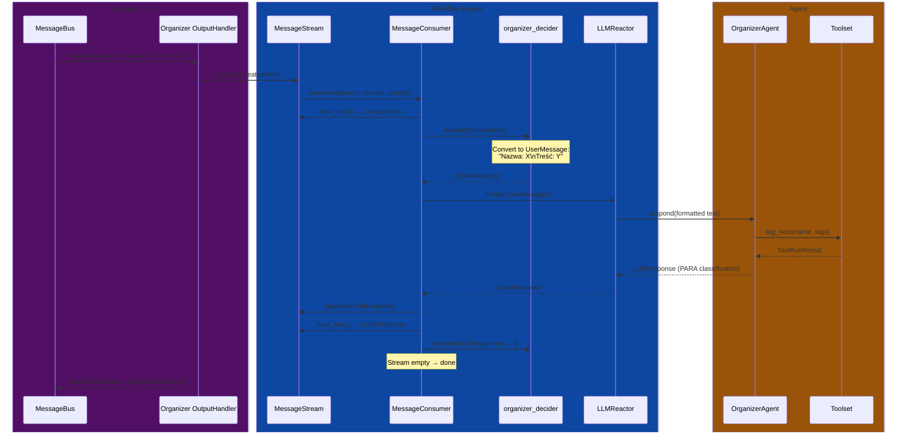

---

## 9. Cross-Workflow Event Flow (ManageNotes → Organizer → RAG)

Shows how creating a note triggers both the Organizer (PARA tagging) and RAG (knowledge base indexing) in parallel via output handlers.

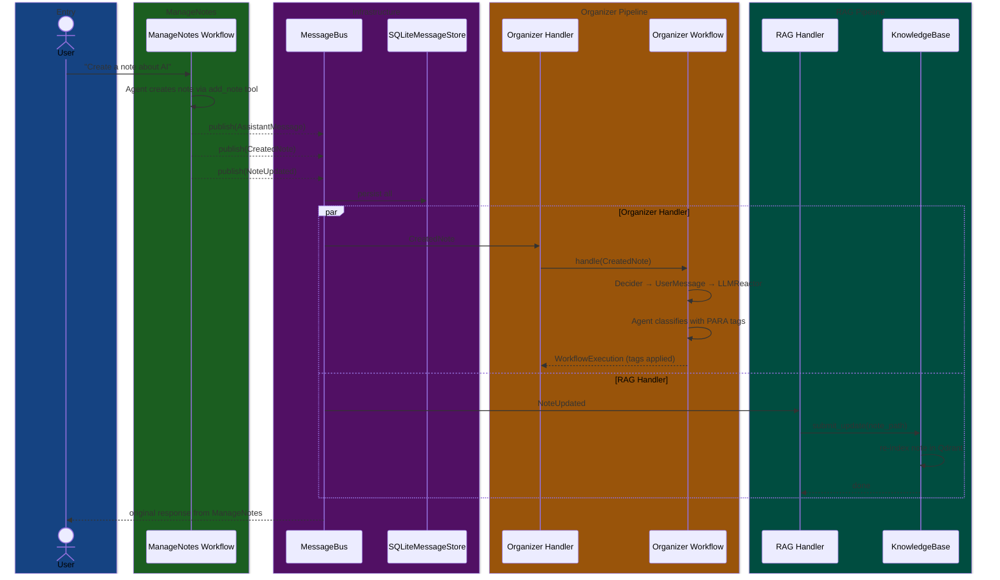

---

## 10. Lab 0 — Simple Agent + Tools

Direct agent call with tool execution. No workflow, no events.

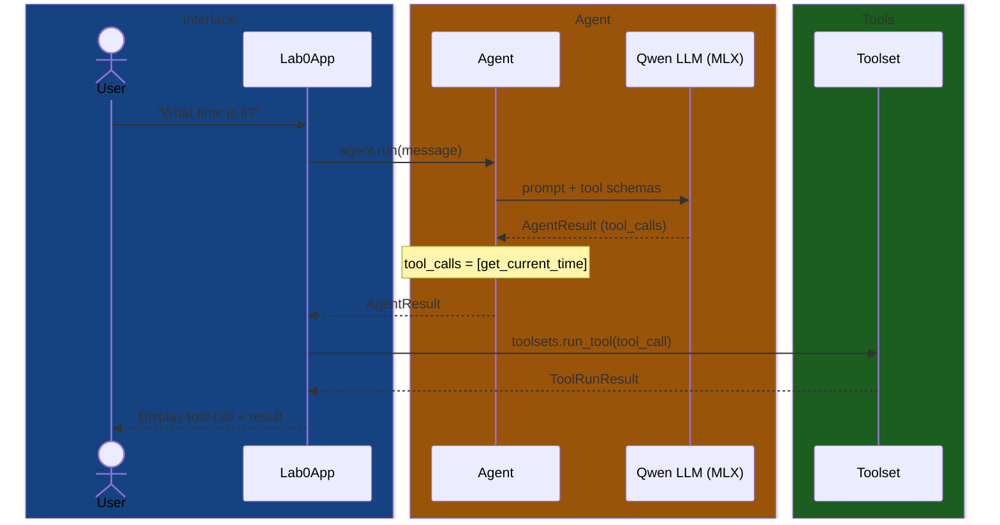

---

## 11. Lab 1 — Writer-Critic with Events

Two agents coordinated via a domain event (WriterCompleted). Introduces the Decider pattern and `dispatch_output_handlers`.

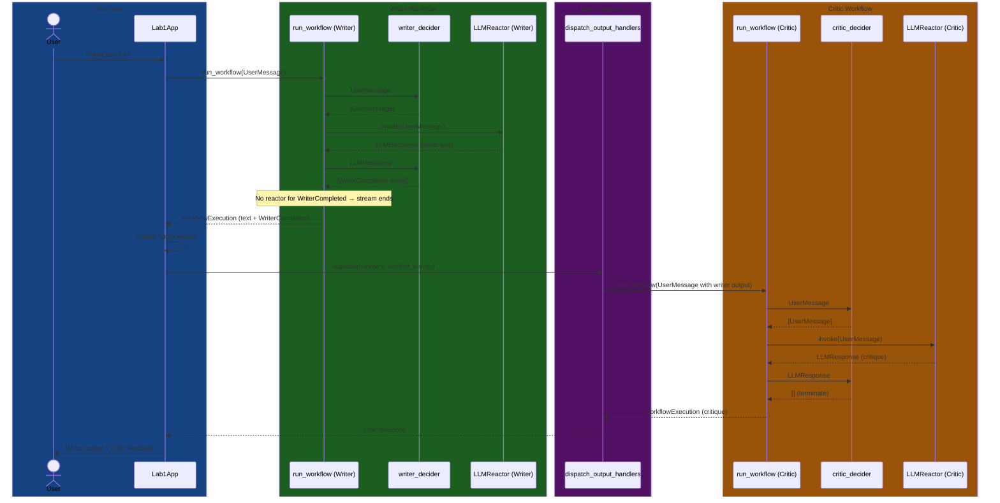

---

## 12. Lab 2 — Planner For-Loop Delegation

Multi-agent orchestration with imperative for-loop. The planner creates tasks, then each is dispatched sequentially.

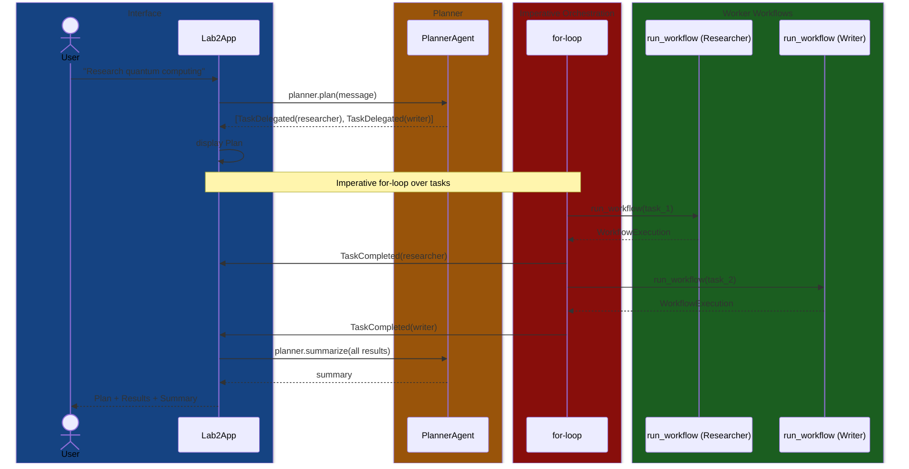

---

## 13. Lab 3 — Event-Driven Planner (No For-Loops)

Same goal as Lab 2, but `dispatch_output_handlers` replaces the for-loop with declarative event routing.

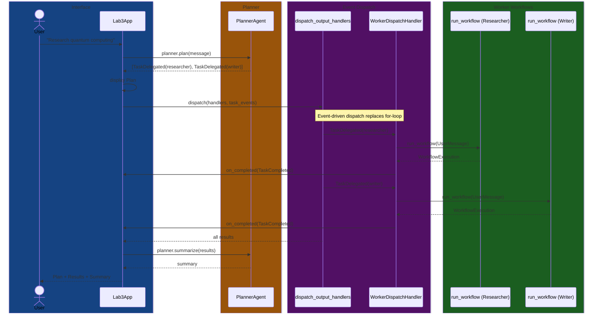

---

## 14. Lab 4 — Full Runtime with Message Bus

Complete infrastructure: central MessageBus, TurnExecutor lifecycle, OutputHandlerDispatcher, and message log for observability.

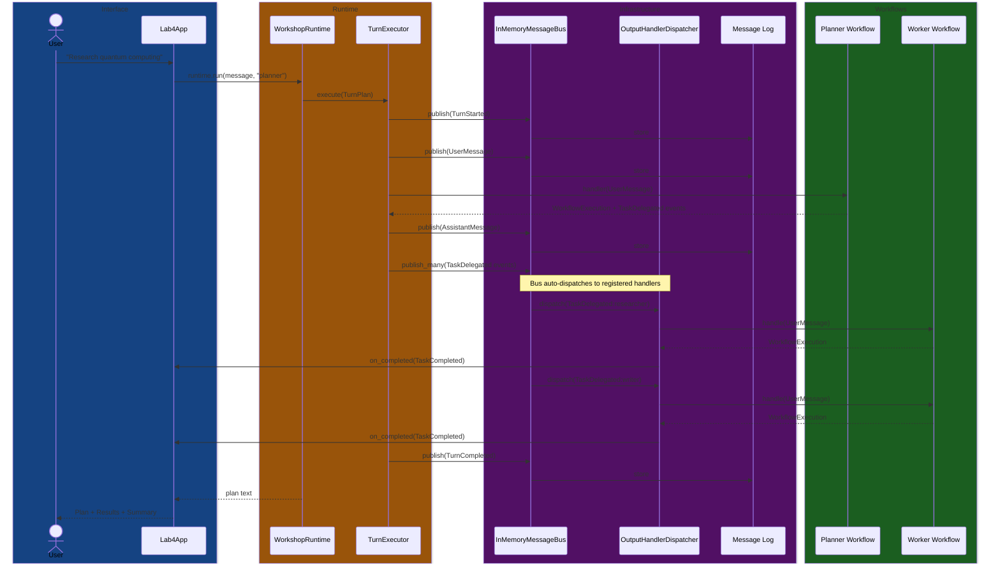

---

## 15. Consumer Loop Detail

The core message processing loop used by all workflows. Decider decides WHAT happens, Reactor handles HOW.

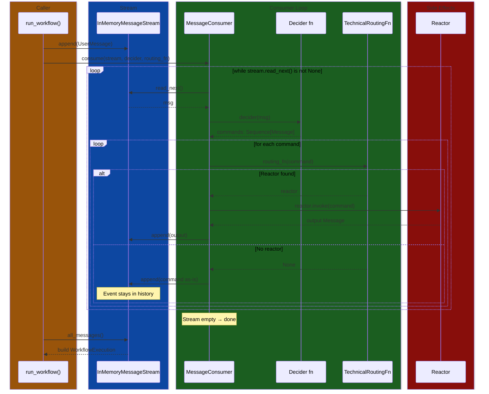

---

## 16. Full End-to-End Flow — Chat to All Agents

Complete swimlane showing the entire message journey from Chat/CLI through routing to every domain workflow, with event-driven side effects.

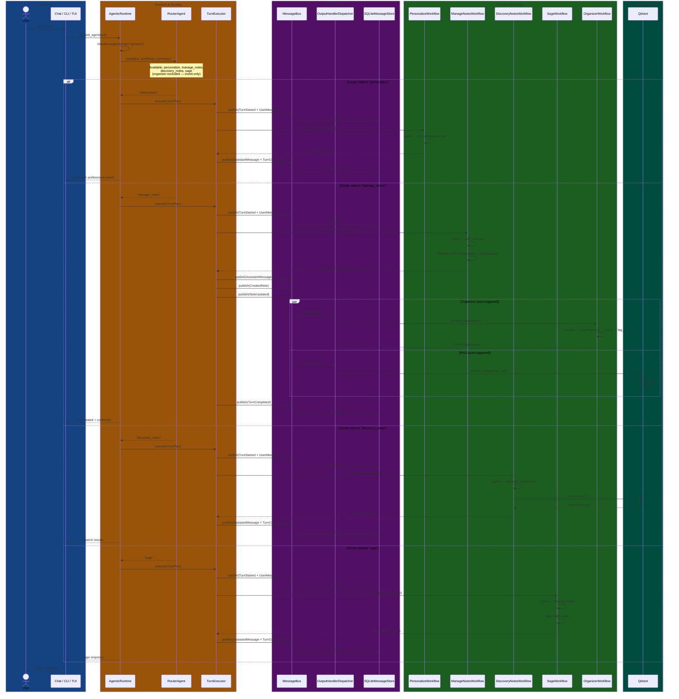

---

## 17. Lab 5 — Vision: Image Summary → Art Writer

User sends image path + text. VLM agent describes the image. Art Writer creates a creative piece from the description. Same pattern as Lab 1 (two agents bridged by domain event) with a new modality.

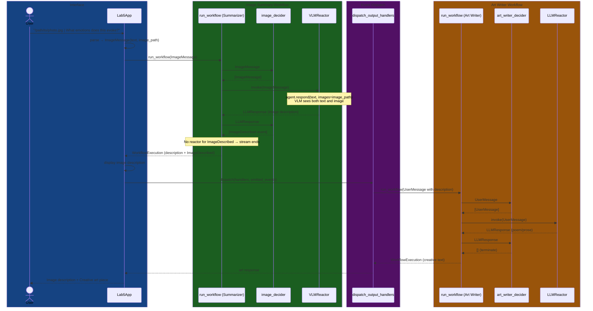
